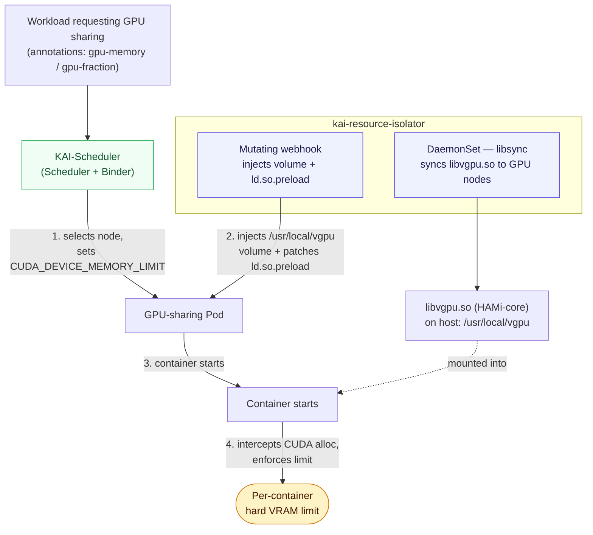

# kai-resource-isolator

> GPU memory isolation for [KAI-Scheduler](https://github.com/NVIDIA/KAI-Scheduler) GPU-sharing workloads, powered by [HAMi-core](https://github.com/Project-HAMi/HAMi-core).

`kai-resource-isolator` enforces a **hard GPU memory limit per container**. KAI-Scheduler lets a Pod request a share of a GPU through `gpu-fraction` or `gpu-memory` annotations (e.g. `gpu-memory: "4096"` for 4096 MiB), but without memory isolation a container can still allocate the full GPU memory at the CUDA level. This project closes that gap: it injects [HAMi-core](https://github.com/Project-HAMi/HAMi-core)'s `libvgpu.so` into GPU-sharing Pods so that CUDA memory allocation calls are intercepted and capped at the amount the Pod was allocated.

## How it works

Two components collaborate to make GPU sharing safe:

| Component | Role |
| --- | --- |
| **DaemonSet** (`libsync`) | Copies `libvgpu.so` (HAMi-core) to `/usr/local/vgpu` on every GPU node |
| **Mutating webhook** | Injects the `/usr/local/vgpu` hostPath volume and patches `/etc/ld.so.preload` into Pods that request GPU-sharing resources |

When a GPU-sharing Pod is submitted, the runtime flow is:

1. **KAI-Scheduler** selects a node and injects the `CUDA_DEVICE_MEMORY_LIMIT` environment variable into the Pod, set to the allocated memory amount.
2. **kai-resource-isolator webhook** injects the `hostPath` volume mount (`/usr/local/vgpu`) and patches `/etc/ld.so.preload` so `libvgpu.so` is loaded when the container starts.
3. The container starts; `libvgpu.so` intercepts CUDA memory allocation calls and enforces the limit set by `CUDA_DEVICE_MEMORY_LIMIT`.



## Prerequisites

- **KAI-Scheduler** ≥ `0.17.0`, deployed with GPU sharing enabled (see [Quick start](#quick-start)).

## Quick start

### 1. Deploy KAI-Scheduler with GPU sharing enabled

Follow the [KAI-Scheduler GPU-sharing guide](https://github.com/NVIDIA/KAI-Scheduler/blob/main/docs/gpu-sharing/gpu-sharing.md) and enable the `gpushare` and `hamicore` plugins:

```bash
helm install kai-scheduler oci://ghcr.io/kai-scheduler/kai-scheduler/kai-scheduler \
  --set global.gpuSharing=true \
  --set binder.plugins.hamicore.enabled=true \
  --namespace kai-scheduler --create-namespace \
  --version v0.17.0
```

### 2. Deploy kai-resource-isolator

Install from the OCI registry:

```bash
helm install kai-resource-isolator oci://docker.io/projecthami/kai-resource-isolator \
  --namespace kai-resource-isolator --create-namespace \
  --set monitor.enabled=true \
  --set monitor.serviceMonitor.enabled=true \
  --version 1.1.0-chart
```

The default `monitor.nodeSelector` is `nvidia.com/gpu.present: "true"` (NVIDIA GPU feature discovery). Set `monitor.runtimeClassName=nvidia` if NVML is only reachable through the NVIDIA runtime handler in your cluster.

> Chart versions carry a `-chart` suffix (e.g. `1.1.0-chart`). See all available versions at [projecthami/kai-resource-isolator](https://hub.docker.com/r/projecthami/kai-resource-isolator/tags) on Docker Hub.

## Per-container VRAM metrics

`kai-vgpu-monitor` is a DaemonSet that reads the shared-memory cache `libvgpu.so` writes for each GPU container and exposes HAMi-compatible gauges: `hami_vgpu_memory_used_bytes`, `hami_vgpu_memory_limit_bytes`, `hami_container_device_utilization_ratio`, and more.

```bash
curl <pod-ip>:9394/metrics
```

## Customization

Tune these Helm values for your environment:

| Value | Default | Purpose |
| --- | --- | --- |
| `paths.containerVgpuMount` | `/usr/local/vgpu` | Mount path inside Pods; must match the DaemonSet install path and `ld.so.preload` |
| `webhook.gpuShareResources` | `nvidia.com/gpu,nvidia.com/gpumem,nvidia.com/gpucores` | Extended-resource list passed to the webhook as `GPU_SHARE_RESOURCES`; injection is keyed off the `gpu-fraction`/`gpu-memory` annotations, not these resources |
| `monitor.nodeSelector` | `nvidia.com/gpu.present: "true"` | Restricts the monitor DaemonSet to GPU nodes |
| `monitor.runtimeClassName` | `""` | Set to `nvidia` if NVML needs the NVIDIA runtime handler |

See [`chart/kai-resource-isolator/values.yaml`](chart/kai-resource-isolator/values.yaml) for the full set.

## Build

The build context must be the **`kai-resource-isolator` repository root** (the directory containing `go.mod`, `libvgpu/`, and `cmd/`).

```bash
git submodule update --init --recursive
docker build -f docker/Dockerfile -t <registry>/<project>/kai-resource-isolator:<tag> .
```

## Contributing

Issues and pull requests are welcome against the [Project-HAMi](https://github.com/Project-HAMi) organization. See the [`OWNERS`](OWNERS) file for maintainers.

## License

Licensed under the **Apache License 2.0**. See [`LICENSE`](LICENSE).
